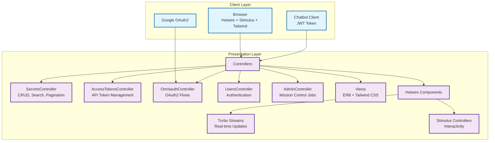
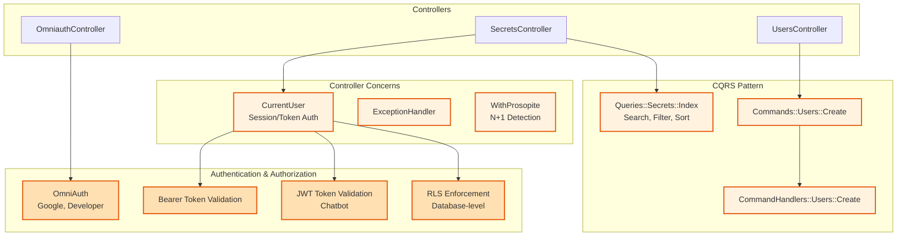
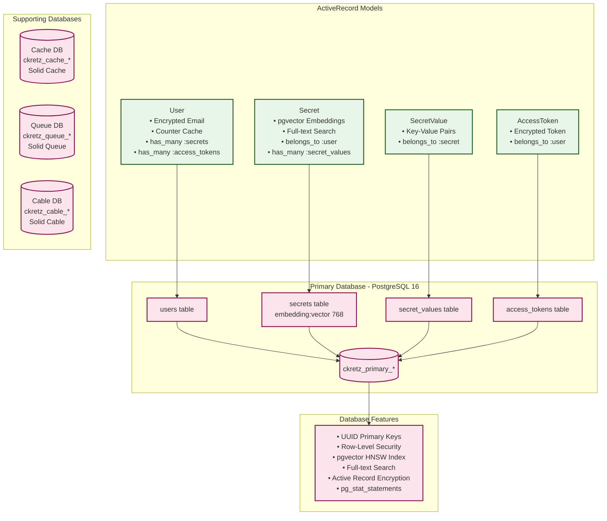
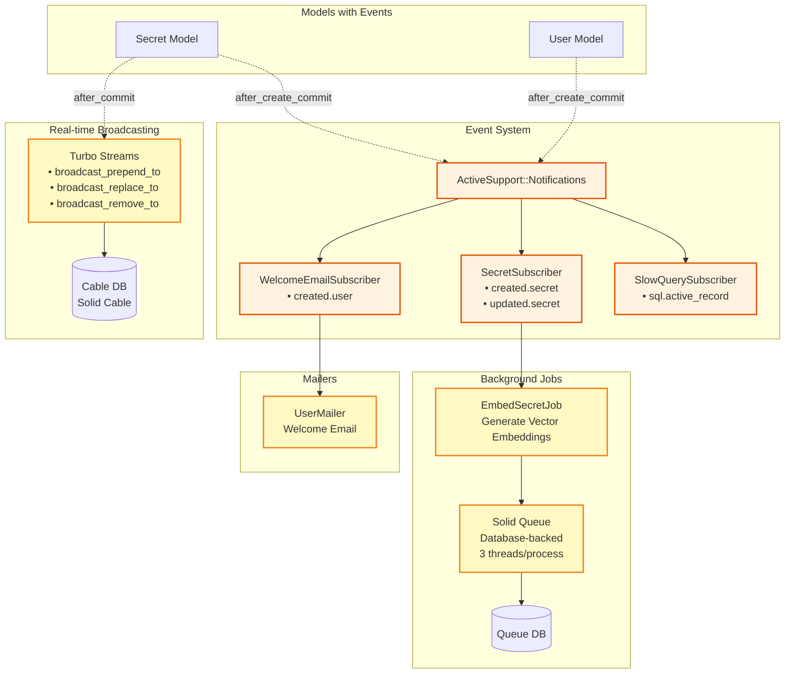
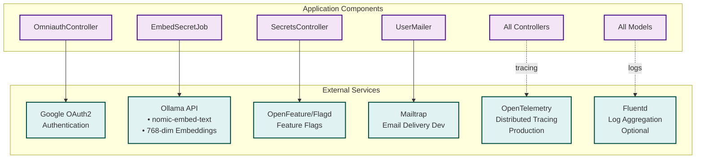
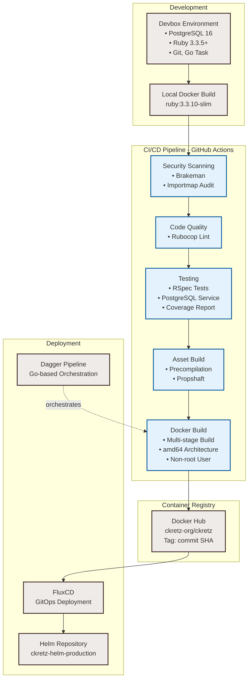

# CKRetz System Architecture

This document describes the system architecture of the CKRetz secrets management application.

## System Architecture Diagrams

The following diagrams break down the system architecture into focused views by layer and concern.

### 1. Client & Presentation Layer

This diagram shows how users interact with the application through browsers and APIs, and how requests flow through controllers to views.



### 2. Application Logic & Authentication

This diagram illustrates the CQRS pattern, authentication mechanisms, and how business logic is organized.



### 3. Data & Database Layer

This diagram shows the data models, their relationships, and the multi-database PostgreSQL setup.



### 4. Background Jobs & Events

This diagram depicts the event-driven architecture and asynchronous job processing.



### 5. External Services Integration

This diagram shows all external service dependencies and their integration points.



### 6. Infrastructure & Deployment

This diagram illustrates the CI/CD pipeline and deployment infrastructure.



## Overview

CKRetz is a modern **Ruby on Rails 8.1** secrets management application featuring:

- **Multi-database PostgreSQL setup** with separate databases for primary data, cache, queue, and WebSocket communications
- **Vector embeddings** using pgvector for semantic search (768-dimensional)
- **Row-Level Security (RLS)** for database-enforced multi-tenancy
- **Event-driven architecture** with ActiveSupport::Notifications
- **Real-time updates** via Hotwire (Turbo Streams + Stimulus)
- **CQRS pattern** for separating reads and writes
- **Modern Rails stack** with Solid Queue, Solid Cache, and Solid Cable

## Technology Stack

### Backend
- **Ruby 3.3.10**
- **Rails 8.1**
- **Puma 6** - Web server
- **PostgreSQL 16** with extensions:
  - pgvector - Vector similarity search
  - pgcrypto - UUID generation
  - citext - Case-insensitive text
  - pg_stat_statements - Query performance analysis

### Frontend
- **Hotwire** (Turbo + Stimulus)
- **Tailwind CSS 3.0**
- **Propshaft** - Asset pipeline
- **Importmap Rails** - JavaScript module loading

### Testing & Quality
- **RSpec** - Testing framework
- **Capybara** - Integration testing
- **SimpleCov** - Code coverage
- **Rubocop** - Code linting
- **Brakeman** - Security scanning

## Database Architecture

The application uses **4 separate PostgreSQL databases**:

1. **Primary Database** (`ckretz_primary_*`)
   - Main application data (Users, Secrets, SecretValues, AccessTokens)
   - UUID primary keys
   - Row-Level Security (RLS) policies
   - pgvector embeddings (768-dimensional)
   - Full-text search capabilities

2. **Cache Database** (`ckretz_cache_*`)
   - Solid Cache storage
   - Database-backed caching

3. **Queue Database** (`ckretz_queue_*`)
   - Solid Queue job persistence
   - Background job processing

4. **Cable Database** (`ckretz_cable_*`)
   - Solid Cable WebSocket storage
   - Real-time communication

## Key Components

### Models & Data Layer

```
User (has_many: secrets, access_tokens, secret_values)
  └── Secret (belongs_to: user, has_many: secret_values)
      └── SecretValue (belongs_to: secret)
  └── AccessToken (belongs_to: user)
```

**Features:**
- Counter caches for performance
- Dependent destruction (cascade delete)
- Vector embeddings for semantic search
- Full-text search using PG Search
- Active Record encryption for sensitive fields

### Controllers & Presentation

- `SecretsController` - CRUD operations, search, pagination, sorting
- `AccessTokensController` - API token management
- `OmniauthController` - OAuth2 authentication (Google, developer)
- `UsersController` - User authentication and welcome
- `AdminController` - Admin panel (Mission Control Jobs)

### Authentication & Authorization

- **OmniAuth** - Google OAuth2 and developer provider
- **Session-based** - Rails session cookies
- **Bearer tokens** - Access tokens for API authentication
- **JWT Tokens** - For chatbot integration
- **Row-Level Security** - Database-enforced user isolation via `rls_rails` gem

### CQRS Pattern

**Queries:**
- `Queries::Secrets::Index` - Complex secret filtering and search

**Commands:**
- `Commands::Users::Create` - User creation command
- `CommandHandlers::Users::Create` - Command execution

## Background Jobs & Events

### Job Queue
- **Solid Queue** - Database-backed job queue
- 3 threads per process, configurable via `JOB_CONCURRENCY`
- `EmbedSecretJob` - Generates vector embeddings via Ollama API

### Event System (ActiveSupport::Notifications)

**Event Subscribers:**
1. `SecretSubscriber` - Triggers embedding generation on secret create/update
2. `WelcomeEmailSubscriber` - Sends welcome email on user registration
3. `SlowQuerySubscriber` - Logs slow database queries (dev only)

## Real-Time Features

### Hotwire Integration
- **Turbo Streams** - Server-sent DOM updates
  - `broadcast_prepend_to "secrets"` - New secrets
  - `broadcast_replace_to "secrets"` - Secret updates
  - `broadcast_remove_to "secrets"` - Secret deletion

- **Solid Cable** - Production WebSocket adapter
  - Database-backed message storage
  - 1-day message retention
  - 0.1s polling interval

## External Service Integrations

1. **Google OAuth2** - User authentication
2. **Ollama API** - AI embeddings (nomic-embed-text model, 768-dim)
3. **OpenFeature/Flagd** - Feature flag management
4. **Mailtrap** - Email delivery (development)
5. **OpenTelemetry** - Distributed tracing (production)
6. **Fluentd** - Log aggregation (optional)

## Data Flow Examples

### Creating a Secret

```
User Form → SecretsController#create
  → Secret.create (with secret_values)
  → after_create_commit hooks:
    1. broadcast_prepend_to "secrets" (Turbo Stream)
    2. ActiveSupport::Notifications.instrument("created.secret")
       └── SecretSubscriber receives event
           └── EmbedSecretJob.perform_later
               └── Calls Ollama API
                   └── Stores embedding in pgvector column
```

### User Authentication

```
Login Form → OmniauthController#callback (OAuth)
  → Commands::Users::Create (find or create user)
  → session[:current_user_id] = user.id
  → Redirect to secrets_path

OR API Request with Token:
  → Header: "Authorization: Bearer <token>"
  → CurrentUser concern extracts token
  → AccessToken.find_by_token(token)
  → RLS policy enforces user isolation
```

### Real-Time Secret Updates

```
Secret Update → broadcast_replace_to "secrets"
  → Solid Cable broadcasts to all subscribers
  → WebSocket message sent to clients
  → JavaScript updates DOM without page reload
```

## Security Features

1. **Encryption**
   - Active Record Encryption (email, tokens)
   - Deterministic encryption for searchable fields
   - Secure key derivation

2. **Authentication**
   - OAuth2 (Google)
   - Bearer token validation
   - Session cookies
   - JWT tokens for chatbot

3. **Authorization**
   - Row-Level Security (database-enforced)
   - User data isolation via RLS policies
   - Counter caches for performance

4. **Input Validation**
   - Rails validators
   - Strong parameters
   - Nested attributes with allow_destroy

5. **Security Scanning**
   - Brakeman (vulnerability scanning)
   - Bundler-audit (dependency auditing)
   - Database consistency checks

## Infrastructure & Deployment

### Development Environment
- **Devbox** - Nix-based development environment
- PostgreSQL 16 with custom extensions
- Ruby 3.3.5+
- Git, Go Task, build tools

### CI/CD Pipeline (GitHub Actions)
1. Ruby security scanning (Brakeman)
2. JavaScript dependency scanning (Importmap audit)
3. Code linting (Rubocop)
4. RSpec test suite with PostgreSQL service
5. Asset precompilation
6. Docker image build (multi-arch: amd64)
7. Docker Hub publication
8. FluxCD deployment trigger

### Containerization
- **Docker** - Multi-stage build
- Base image: `ruby:3.3.10-slim`
- Build stage: Dependencies + gems + assets
- Runtime stage: Minimal image with non-root user
- Exposed port: 3000

### Deployment
- **FluxCD** - GitOps continuous deployment
- Target: `ckretz-org/ckretz-helm-production` Helm repository
- Automated version tagging with commit SHA

## Monitoring & Observability

### Logging
- **Lograge** - Structured logging
- **Fluentd** - Log collection (optional)
- **OpenSearch integration** - Via fluent-plugin-opensearch

### Performance Monitoring
- **Rack Mini Profiler** - Request profiling (development)
- **Prosopite** - N+1 query detection (development)
- **pg_query** - SQL parsing and analysis
- **Rails Query Log Tags** - Automatic query logging

### Health Checks
- `/up` endpoint - Rails health check
- `/api/app/info` - Application information

## Architectural Patterns

1. **Row-Level Security (RLS)** - Database-enforced multi-tenancy
2. **Event-Driven Architecture** - Via ActiveSupport::Notifications
3. **CQRS Pattern** - Separate queries and commands
4. **Repository Pattern** - ActiveRecord models as repositories
5. **Dependency Injection** - Via controller concerns and service objects
6. **Real-Time Updates** - Hotwire (Turbo + Stimulus) with Solid Cable
7. **Feature Flags** - OpenFeature for gradual rollout control
8. **Encryption at Rest** - Active Record Encryption for sensitive fields

## Scalability Considerations

1. **Database Sharding Ready** - Multi-database setup supports horizontal scaling
2. **Caching** - Solid Cache with database backend
3. **Vector Search** - HNSW index on pgvector for fast similarity search
4. **Job Queue** - Solid Queue for distributed job processing
5. **Real-Time** - Solid Cable scales across multiple processes/servers
6. **Asset Pipeline** - Propshaft with digest stamping for CDN caching